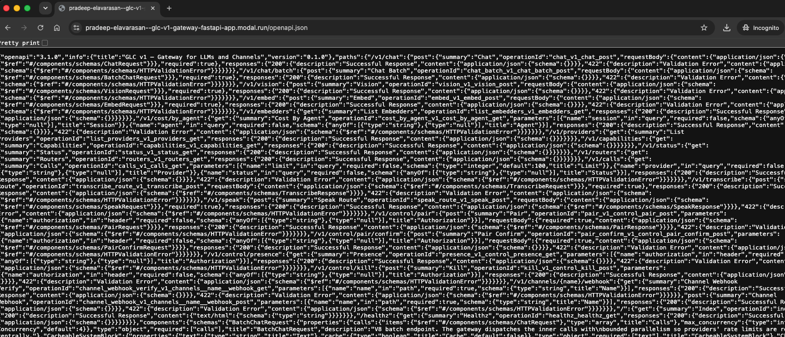
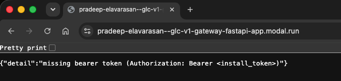
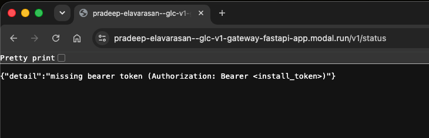

# Findings

Each entry below documents one security finding against this gateway: the invariant it broke, and the fix that closes it, with before/after evidence. See the [README](README.md) for a summary table and how to run the gateway.

---

## 1. Unauthenticated reads and actions (full route map, config disclosure, LLM abuse)

#### Invariant broken
Nothing on the gateway should be reachable — or even discoverable — without the per-installation token. A stranger with only the URL should learn nothing about what routes exist, and should not be able to act on any of them.

#### What's the problem?
- **1.1 — Recon: full route map** — the OpenAPI schema (`/openapi.json`) and interactive docs (`/docs`) were served publicly, giving anyone who found the URL a full blueprint of every route, method, and schema before sending a single real request.
- **1.2 — Config disclosure** (`/v1/status`, `/v1/providers`, `/v1/capabilities`) — these read endpoints answered with no authentication, revealing the provider order, the model behind each provider, and the exact `rpm`/`rpd`/`tpm` rate limits.
- **1.3 — Unauthenticated LLM abuse** (`/v1/chat`) — the chat endpoint itself accepted requests from anyone with no token at all, so a stranger could run up LLM provider usage and cost with no credential.
- **1.4 — Usage and cost read** (`/v1/cost/by_agent`, `/v1/calls`) — usage and per-agent cost data was readable with no auth; empty on a fresh deploy, but it exposes activity once the gateway is in use.

One before-fix capture stands in as the example for all four: the full, unauthenticated `/openapi.json` response below lists `/v1/chat`, `/v1/status`, `/v1/providers`, `/v1/capabilities`, `/v1/cost/by_agent`, and `/v1/calls` right alongside every other route, method, and schema — confirming none of them needed a token at the time.



#### Root cause
All four trace back to the same human oversight: only two route groups (the control plane and the channel websocket handshake) were ever given a per-installation token check. The schema, the config reads, the chat endpoint, and the usage/cost reads were written before there was any gateway-wide authentication to fall back on, so nobody added a check to them individually.

#### Solution
One fix closes all four, since it applies to every route rather than each one individually:
- **1.1 — Recon: full route map** — `docs_url`, `redoc_url`, and `openapi_url` now only register when `GLC_ENABLE_DOCS=1` is explicitly set. Deployments don't set it, so those routes don't exist at all — a request gets a plain `404`, not even a `401` that would confirm something's there.
- **1.2–1.4 — Config disclosure, unauthenticated LLM abuse, and usage/cost read** — one middleware now requires `Authorization: Bearer <install-token>` on every HTTP request except `/healthz`, instead of leaving auth to be remembered route-by-route. It reuses the same per-installation token already generated for the control plane and channel adapters, and covers `/v1/status`, `/v1/providers`, `/v1/capabilities`, `/v1/chat`, `/v1/cost/by_agent`, and `/v1/calls` along with everything else.
- Files touched: `glc/main.py`, `tests/conftest.py`, `tests/test_control_plane.py`.

Proof after the fix, captured against the live deployment — one per sub-issue:

**1.1 — `/openapi.json` / `/docs`** are no longer served; an unauthenticated request is rejected:



**1.2 — config read (`/v1/status`)** now requires the token:



Authenticated callers still get through, confirming the fix didn't break legitimate use:

```sh
GATEWAY_URL="https://pradeep-elavarasan--glc-v1-gateway-fastapi-app.modal.run"

curl -s -o /dev/null -w "%{http_code}\n" -H "Authorization: Bearer <install-token>" "$GATEWAY_URL/v1/status"       # 200
curl -s -o /dev/null -w "%{http_code}\n" -H "Authorization: Bearer <install-token>" "$GATEWAY_URL/v1/providers"    # 200
curl -s -o /dev/null -w "%{http_code}\n" -H "Authorization: Bearer <install-token>" "$GATEWAY_URL/v1/capabilities" # 200
```

**1.3 — chat (`/v1/chat`)** rejects an unauthenticated request before it reaches any provider:

```console
$ curl -s -X POST "https://pradeep-elavarasan--glc-v1-gateway-fastapi-app.modal.run/v1/chat" -H 'content-type: application/json' -d '{"model":"gemini-2.5-flash","messages":[{"role":"user","content":"hi"}]}'
{"detail":"missing bearer token (Authorization: Bearer <install_token>)"}
```

**1.4 — usage/cost read (`/v1/cost/by_agent`)** rejects an unauthenticated read:

```console
$ curl -s "https://pradeep-elavarasan--glc-v1-gateway-fastapi-app.modal.run/v1/cost/by_agent"
{"detail":"missing bearer token (Authorization: Bearer <install_token>)"}
```

**1.5 — Control plane (reference, already gated — nothing to fix)** — the control plane (`/v1/control/*`) already required the install token before this fix; it's the model the data-plane fix (1.1–1.4) now matches. Shown here as the contrast between a guarded and a (previously) unguarded endpoint:

```console
$ curl -s "https://pradeep-elavarasan--glc-v1-gateway-fastapi-app.modal.run/v1/control/presence"
{"detail":"missing bearer token (Authorization: Bearer <install_token>)"}
```

---

## 2. SSRF via the image URL resolver

#### Invariant broken
The gateway must never fetch a caller-supplied URL that points at internal infrastructure. A caller must not be able to use the gateway as a proxy to reach addresses — loopback, private networks, cloud metadata — that they could not reach directly.

#### What's the problem?
Before calling the model, the gateway fetched any `http(s)` image URL supplied in a chat or vision request — server-side, following redirects, with no check on the destination. Two things were wrong:
- **Internal targets were reachable.** A caller could point `image_url` at an internal address (loopback, the cloud-metadata endpoint `169.254.169.254`, private hosts) and the gateway would fetch it on their behalf. Even a URL that looked public could redirect into an internal address and still be followed.
- **There was no way to limit destinations at all.** Beyond internal addresses, the resolver would fetch from *any* host on the public internet, with no notion of an approved list — an unbounded outbound surface (e.g. exfiltrating data to, or pulling arbitrary content from, a server the caller controls).

Reproduced against the live deployment: a probe pointing `image_url` at a caller-controlled `webhook.site` URL was fetched server-side. The webhook logged the incoming request with the gateway's own user-agent (`Mozilla/5.0 (compatible; GLCv1/0.1; +image-resolver)`) — proof the gateway, not the caller, made the outbound request. It failed only later on the mock provider key; the fetch itself was completely unrestricted.


#### Root cause
The image resolver (`glc/routes/chat.py`, `_fetch_to_data_url`) fetched the URL with httpx's automatic redirect following and no validation of the destination at all — neither a check that the host wasn't internal, nor any concept of an approved-destination list. It simply fetched whatever it was handed. Both `/v1/chat` and `/v1/vision` route through this single function, so the gap applied to both.

#### Solution
A new guard (`glc/security/ssrf.py`) validates every URL before it is fetched, and the resolver was rewritten to use it:
- **Block internal ranges (always on).** The host is resolved and rejected if any resolved address is loopback, private, link-local, reserved, multicast, or unspecified — covering IPv4 and IPv6, including IPv4-mapped IPv6. Only `http`/`https` schemes are allowed.
- **Re-check every redirect.** Automatic redirects are disabled; the resolver follows them manually and re-validates each hop, so an allowed public URL can't `302` into an internal address.
- **Connect to the validated IP.** The fetch connects straight to the resolved address (keeping the `Host` header and TLS SNI as the original hostname), so a host can't be flipped to an internal address between validation and fetch (DNS rebinding).
- **Optional host allowlist.** Setting `GLC_IMAGE_URL_ALLOWLIST` to a comma-separated host list restricts the resolver to only those hosts; off by default, so any public host is fetchable while internal ranges stay blocked.
- Files touched: `glc/security/ssrf.py` (new), `glc/routes/chat.py`, `tests/test_ssrf.py` (new).

After the fix — an internal address is refused before any connection is made:

```console
$ curl -s -w "\nHTTP:%{http_code}\n" -X POST "$GATEWAY_URL/v1/chat" -H "Authorization: Bearer $TOKEN" -H 'content-type: application/json' -d '{"model":"gemini-2.5-flash","messages":[{"role":"user","content":[{"type":"image_url","image_url":{"url":"http://169.254.169.254/latest/meta-data/"}}]}]}'
{"detail":"blocked image url 'http://169.254.169.254/latest/meta-data/': host '169.254.169.254' resolves to blocked address 169.254.169.254"}
HTTP:400
```

With the optional allowlist enabled (`GLC_IMAGE_URL_ALLOWLIST=google.com,www.google.com`), any host outside the list is refused too — here the same webhook URL from the reproduction:

```console
$ curl -s -w "\nHTTP:%{http_code}\n" -X POST "$GATEWAY_URL/v1/chat" -H "Authorization: Bearer $TOKEN" -H 'content-type: application/json' -d '{"model":"gemini-2.5-flash","messages":[{"role":"user","content":[{"type":"image_url","image_url":{"url":"https://webhook.site/e913d306-964d-4a2d-95f7-5fa87a4aac32"}}]}]}'
{"detail":"blocked image url 'https://webhook.site/e913d306-964d-4a2d-95f7-5fa87a4aac32': host 'webhook.site' is not in the image-url allowlist"}
HTTP:400
```

---

## 3. Verbose upstream errors

#### Invariant broken
An error returned to the client must not reveal internal implementation detail — which upstream provider was used, its endpoint, or its raw error response. That detail belongs in server-side logs only.

#### What's the problem?
When an upstream provider call failed, the gateway passed the provider's raw error straight back to the client: the provider name (`gemini`), the upstream HTTP status, the full upstream error body, and the upstream endpoint (`generativelanguage.googleapis.com`). That hands an attacker a free map of the gateway's backends and their infrastructure before probing anything.

```console
$ curl -s -w "\nHTTP:%{http_code}\n" -X POST "$GATEWAY_URL/v1/chat" -H "Authorization: Bearer $TOKEN" -H 'content-type: application/json' -d '{"model":"gemini-2.5-flash","messages":[{"role":"user","content":"hi"}]}'
{"detail":"gemini failed: gemini HTTP 400: {\n  \"error\": {\n    \"code\": 400,\n    \"message\": \"API key not valid. Please pass a valid API key.\",\n    \"status\": \"INVALID_ARGUMENT\",\n    \"details\": [\n      {\n        \"@type\": \"type.googleapis.com/google.rpc.ErrorInfo\",\n        \"reason\": \"API_KEY_INVALID\",\n        \"domain\": \"googleapis.com\",\n        \"metadata\": {\n          \"service\": \"generativelanguage.googleapis.com\"\n        }\n      },\n      {\n   "}
HTTP:502
```

#### Root cause
Several route handlers built their client-facing error by interpolating the raw provider error directly — e.g. `raise HTTPException(502, f"{name} failed: {e}")`. The full detail was already recorded server-side (the audit log), but it was *also* echoed back to the caller. The same pattern was present across `/v1/chat`, `/v1/embed`, `/v1/transcribe`, and `/v1/speak`.

#### Solution
A shared helper (`glc/routes/errors.py`, `upstream_error`) now logs the full upstream detail server-side and returns a generic message to the client. Every upstream-error site across the chat, embed, transcribe, and speak routes was switched to it, so no response names a provider, names an endpoint, or includes a raw upstream body. Client-input errors (malformed base64, unknown provider, oversized input) are left unchanged, since those describe the caller's own request rather than a backend.

- Files touched: `glc/routes/errors.py` (new), `glc/routes/chat.py`, `glc/routes/transcribe.py`, `glc/routes/speak.py`, `tests/test_error_sanitization.py` (new).

After the fix — the same request now gets a generic message with no provider, endpoint, or upstream body:

```console
$ curl -s -w "\nHTTP:%{http_code}\n" -X POST "$GATEWAY_URL/v1/chat" -H "Authorization: Bearer $TOKEN" -H 'content-type: application/json' -d '{"model":"gemini-2.5-flash","messages":[{"role":"user","content":"hi"}]}'
{"detail":"upstream provider request failed"}
HTTP:502
```

The full detail is still captured, but only in the server-side logs (visible via `modal app logs`):

```text
upstream error [502]: gemini failed: gemini HTTP 400: {... "service": "generativelanguage.googleapis.com" ...}
```

<!--
## N. <finding title>

#### Invariant broken
Which security guarantee this violates.

#### What's the problem?
What's wrong and how it could be exploited.

#### Root cause
Why the code ended up this way — the underlying design or assumption that let the problem in.

#### Solution
How we fixed it — what changed, and the file(s) touched. Include before/after screenshots or command output here to show the fix working.
-->
